# 🌲 Proyecto I — Orquestación, entrenamiento y modelos (Grupo 5)

Entorno de MLOps desplegado con **Docker Compose** en una máquina virtual. **Airflow**
recolecta datos del conjunto *Forest Cover Type* desde un API externo, una petición por
ejecución, y los lleva por tres etapas en **PostgreSQL** (sin procesar → procesada →
lista para entrenamiento). **JupyterLab** entrena varios modelos y los guarda versionados
en **MinIO**, y un **API de inferencia con FastAPI** sirve el modelo en producción.

---

## ⭐ Puntos clave

- **Resultado del despliegue en la VM:** 57.968 filas recolectadas del API del
  profesor (99,8% del pool disponible), idénticas en las tres etapas, y un Random
  Forest con macro-F1 0,860 sirviendo predicciones (sección 14).
- **Una petición por ejecución del DAG**, como exige el enunciado. El DAG corre cada
  minuto, deduplica al insertar y lleva los datos nuevos por las tres etapas
  en cada corrida.
- **Hallazgo verificado sobre el API de datos:** el número de batch es solo una
  etiqueta. Todas las peticiones del grupo 5 muestrean la misma porción del dataset.
  Se comprobó contra la copia local y contra el API real del profesor (sección 5).
- **Dos PostgreSQL separados:** uno para los datos (esquemas `raw`, `processed` y
  `training`) y otro para los metadatos de Airflow. Así se pueden re-recolectar los
  datos sin perder el historial de ejecuciones.
- **Modelos inmutables y versionados en MinIO.** La promoción es explícita, con
  campeón contra retador sobre el mismo conjunto de prueba. Un puntero
  `production.json` indica qué modelo sirve el API.
- **Reproducibilidad:** scikit-learn, numpy, scipy y pandas están fijados a las
  mismas versiones exactas en Jupyter y en el API, con `uv.lock`. El API **se niega a
  arrancar** si sus versiones no coinciden con las del modelo.
- **Desbalance de clases tratado:** la clase 3 tiene decenas de filas y las clases
  0 y 1 decenas de miles. Por eso se usa `class_weight="balanced"` y se elige el
  modelo por **macro-F1**, no por accuracy.

---

## 📑 Contenido

1. [Cumplimiento del enunciado](#1-cumplimiento-del-enunciado)
2. [Arquitectura](#2-arquitectura)
3. [Servicios](#3-servicios)
4. [Orden de arranque](#4-orden-de-arranque)
5. [La fuente de datos y un hallazgo importante](#5-la-fuente-de-datos-y-un-hallazgo-importante)
6. [El DAG de recolección](#6-el-dag-de-recolección)
7. [Base de datos: tres etapas](#7-base-de-datos-tres-etapas)
8. [Entrenamiento en Jupyter](#8-entrenamiento-en-jupyter)
9. [Almacenamiento de modelos en MinIO](#9-almacenamiento-de-modelos-en-minio)
10. [API de inferencia](#10-api-de-inferencia)
11. [Reproducibilidad y versiones](#11-reproducibilidad-y-versiones)
12. [Despliegue en la VM paso a paso](#12-despliegue-en-la-vm-paso-a-paso)
13. [Pruebas locales sin gastar el API del profesor](#13-pruebas-locales-sin-gastar-el-api-del-profesor)
14. [Verificación y evidencias](#14-verificación-y-evidencias)
15. [Problemas encontrados y prevenidos](#15-problemas-encontrados-y-prevenidos)
16. [Qué cambios requieren reconstruir](#16-qué-cambios-requieren-reconstruir)
17. [Alcance y limitaciones](#17-alcance-y-limitaciones)
18. [Estructura del repositorio](#18-estructura-del-repositorio)

---

## 1. Cumplimiento del enunciado

| Requisito del enunciado | Cómo se cumple | Dónde |
|---|---|---|
| Entorno completo con Docker Compose en la VM | 10 servicios en un solo `docker-compose.yml` | [`docker-compose.yml`](docker-compose.yml) |
| Airflow orquesta la recolección desde el API externo | DAG `covertype_pipeline`, cada minuto | [`dags/covertype_pipeline.py`](dags/covertype_pipeline.py) |
| **Una petición por ejecución del DAG** (no N peticiones y luego procesar) | Cada corrida hace 1 petición y procesa sus propios datos | [Sección 6](#6-el-dag-de-recolección) |
| Extraer al menos una porción de cada batch | El DAG corre hasta que el API responde con el tope (tras el batch 11) | [Sección 6](#6-el-dag-de-recolección) |
| PostgreSQL con varias etapas: sin procesar, procesada y lista para entrenamiento | Esquemas `raw`, `processed` y `training` | [`postgres/init/01_schema.sql`](postgres/init/01_schema.sql) |
| Entrenamiento de modelos | 3 candidatos en JupyterLab | [`notebooks/train_covertype.ipynb`](notebooks/train_covertype.ipynb) |
| Modelos almacenados en MinIO | Bucket `models`, versiones inmutables y puntero de producción | [Sección 9](#9-almacenamiento-de-modelos-en-minio) |
| API de inferencia (FastAPI) que consume el modelo desde MinIO | Lee `production.json` y carga el modelo | [`api/main.py`](api/main.py) |
| Interfaces gráficas expuestas | Airflow `:8010`, MinIO `:8011`, Jupyter `:8012`, API `:8025` | [Sección 3](#3-servicios) |

---

## 2. Arquitectura

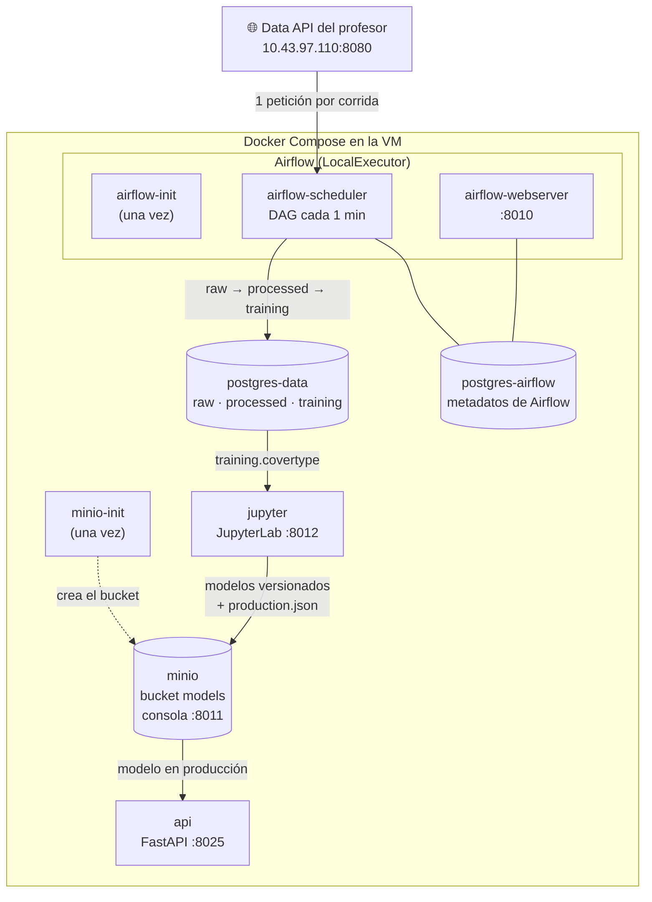

El flujo tiene tres fases independientes:

1. **Recolección (automática).** Airflow consulta el API externo cada minuto. Los datos
   nuevos de cada petición recorren `raw → processed → training` en la misma corrida.
2. **Entrenamiento (manual).** En JupyterLab, cuando ya hay datos suficientes. Los
   modelos se guardan en MinIO y el mejor se promueve.
3. **Inferencia (continua).** El API sirve el modelo que indica `production.json`. No
   depende de que el DAG esté corriendo.

---

## 3. Servicios

| Servicio | Imagen | Responsabilidad | Puerto en el host | Healthcheck |
|---|---|---|---|---|
| `postgres-data` | `postgres:15` | Datos del proyecto en 3 esquemas | — (interno) | `pg_isready` |
| `postgres-airflow` | `postgres:15` | Metadatos de Airflow (corridas, estados, usuarios) | — (interno) | `pg_isready` |
| `airflow-init` | `apache/airflow:2.9.3` | Migra el esquema de Airflow, crea el usuario admin y termina | — | termina con `Exited (0)` |
| `airflow-scheduler` | `apache/airflow:2.9.3` | Programa y **ejecuta** las tareas del DAG | — | — |
| `airflow-webserver` | `apache/airflow:2.9.3` | Interfaz web de Airflow | **8010** | — |
| `minio` | `cgr.dev/chainguard/minio@sha256:…` | Almacenamiento de objetos para los modelos | **8011** (consola) | `mc ready local` |
| `minio-init` | misma imagen de MinIO | Crea el bucket `models` y termina | — | termina con `Exited (0)` |
| `jupyter` | construida desde `jupyter/` | JupyterLab para el entrenamiento | **8012** | — |
| `api` | construida desde `api/` | API de inferencia | **8025** | `GET /health` |
| `data-api` | construida desde `data_api/` | **Copia local** del API del profesor, solo para pruebas (perfil `local-data-api`) | 8020 | — |

**Notas de diseño:**

- **Imagen oficial de Airflow, sin personalizar.** Ya incluye `HttpHook`,
  `PostgresHook` y `execute_values`. El DAG no entrena modelos, así que no necesita
  pandas ni scikit-learn.
- **Configuración común con un ancla YAML.** init, scheduler y webserver comparten
  imagen, usuario, variables y volúmenes a través de `x-airflow-common`, escritos una
  sola vez.
- **Las bases de datos no publican puertos.** Los servicios las alcanzan por la red
  interna de Docker (`postgres-data:5432`). Los puertos publicados respetan el rango
  permitido de la VM, 8000–8025.
- **MinIO publica solo la consola web (9001).** El API S3 (9000) queda interno: Jupyter
  y el API de inferencia lo usan como `http://minio:9000`.
- **Conexiones de Airflow como variables de entorno.** `AIRFLOW_CONN_DATA_API` y
  `AIRFLOW_CONN_POSTGRES_DATA` salen de `.env`. El DAG solo usa sus IDs.

---

## 4. Orden de arranque

Compose respeta estas dependencias con `depends_on` y condiciones. `service_healthy`
espera al healthcheck, no solo a que el proceso arranque.
`service_completed_successfully` espera a que un contenedor de inicialización termine
con código 0.

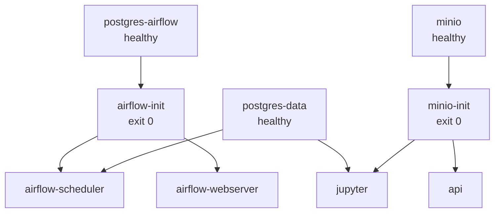

`airflow-init` y `minio-init` aparecen como **`Exited (0)`** en `docker compose ps`.
Es su comportamiento correcto: corren una vez y terminan. Ambos son idempotentes, así
que ejecutarlos en cada `up` no rompe nada.

---

## 5. La fuente de datos y un hallazgo importante

### Cómo funciona el API del profesor

- **Endpoint:** `GET http://10.43.97.110:8080/data?group_number=5`
- **Respuesta:** `{"group_number", "batch_number", "data"}`. `data` trae filas de 13
  valores **como texto y sin encabezado**. El DAG les asigna los nombres de columna.
- **Formato crudo:** `Wilderness_Area` llega como nombre (`"Rawah"`) y `Soil_Type`
  como código (`"C7202"`), no como columnas one-hot.
- **Rotación de batch:** el número de batch sube en la primera petición que llegue
  **más de 300 s** después del último cambio. Esperar no hace perder batches.
- **Tope:** después del batch 11, toda petición responde
  `400 "Ya se recolectó toda la información minima necesaria"`.
- **El contador del grupo vive en el servidor del profesor.** Cada petición de prueba
  consume ventanas reales, por eso existe una copia local para probar.

### El hallazgo: el batch no cambia los datos

En el código del API, `get_batch_data(group_number)` usa el **número de grupo** para
elegir la porción del dataset, no el de batch. Cada petición del grupo 5 devuelve una
muestra aleatoria del 10% (5.810 filas) de **la misma porción** de 58.101 filas.

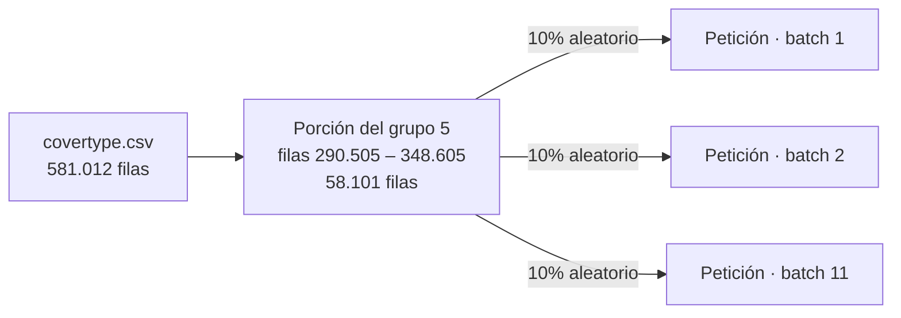

**Verificado empíricamente** con [`scripts/check_overlap.py`](scripts/check_overlap.py).
Dos muestras aleatorias del mismo pool comparten cerca del 10% de sus filas (~581). Si
los batches fueran porciones distintas, compartirían **0**:

| Filas compartidas | API real del profesor | Copia local |
|---|---|---|
| Dentro del mismo batch | 600 | 578 |
| Entre batch 1 y batch 2 | **575** | 571 |

Además, las 11.620 filas recibidas del API real existen en el `covertype.csv` local y
todas vienen de la misma porción, incluido el batch 2.

**Consecuencias de diseño:**

- **Los duplicados son masivos.** Por eso se deduplica al insertar.
- **Más peticiones significan más cobertura del pool.** Con el DAG cada minuto hay
  ~5 peticiones por ventana de 5 min, unas ~55 en total. Con un schedule de 6 min
  serían ~11. Cobertura estimada con `1 − 0,9ⁿ` (fracción del pool vista tras
  n muestras aleatorias del 10%): ~99% frente a ~69%. **Medido en la recolección
  real: 57.968 filas únicas de 58.101 posibles (99,8%)**, lo que confirma la estimación.
- **`Cover_Type` va de 0 a 6** en este dataset, no de 1 a 7 como dice la tabla del
  enunciado.

---

## 6. El DAG de recolección

**DAG:** `covertype_pipeline` · **schedule:** cada 1 minuto · `catchup=False` ·
`max_active_runs=1` · `retries=1` con `retry_delay=15s`.

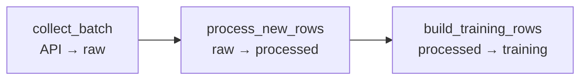

### Qué hace cada corrida

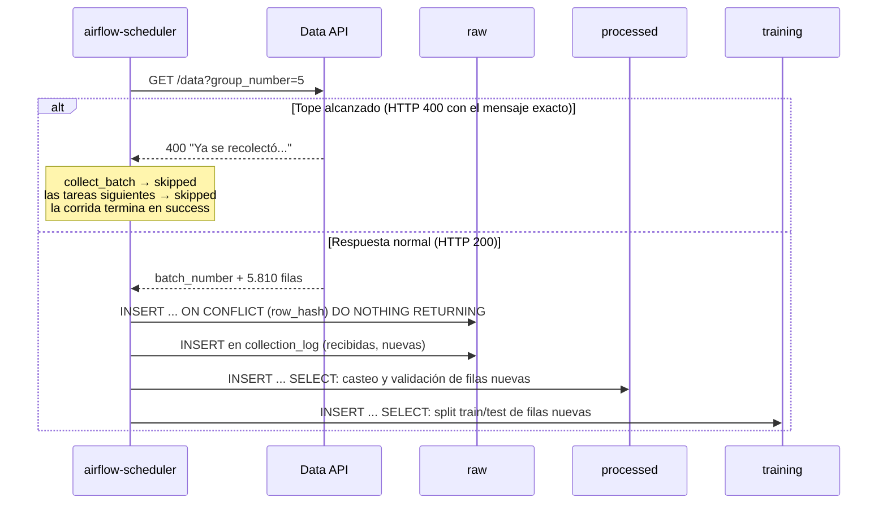

### Las tres tareas

| Tarea | Lee | Escribe | Detalle clave |
|---|---|---|---|
| `collect_batch` | Data API (vía `HttpHook`) | `raw.covertype`, `raw.collection_log` | Calcula un hash MD5 de los 13 valores de cada fila y lo usa como llave primaria. `ON CONFLICT DO NOTHING` descarta duplicados, y `RETURNING` cuenta exactamente las filas nuevas. Filas y log se guardan en **una sola transacción**. |
| `process_new_rows` | `raw.covertype` | `processed.covertype` | Castea texto a enteros y valida rangos (aspect 0–360, hillshade 0–255, clase 0–6). Las filas inválidas se descartan en vez de romper la sentencia. |
| `build_training_rows` | `processed.covertype` | `training.covertype` | Agrega la columna `split`, derivada del hash (~20% test). Una fila nunca cambia de split aunque lleguen más datos. |

### Reglas de diseño

- **Una petición por corrida.** Nunca se hace un bucle de peticiones dentro de una
  ejecución (regla del enunciado).
- **Incremental.** Cada etapa procesa solo las filas que aún no existen en la etapa
  siguiente, comparando por `row_hash`. Cada corrida cuesta lo mismo con 5 mil o con
  60 mil filas.
- **Idempotente.** Re-ejecutar una corrida no duplica nada.
- **El tope produce *skip*, no *fail*.** Solo el 400 con el mensaje exacto del tope se
  trata como skip. Cualquier otro error (otro 400, 5xx, timeout) hace fallar la tarea,
  para no ocultar errores de configuración.
- **`catchup=False`.** Con `catchup=True`, activar el DAG lanzaría miles de corridas
  atrasadas y agotaría el tope en minutos.
- **`retry_delay` de 15 s.** Con schedule de 1 min y `max_active_runs=1`, el valor por
  defecto (5 min) frenaría las corridas siguientes.

---

## 7. Base de datos: tres etapas

El esquema se crea automáticamente la primera vez que arranca `postgres-data`, con
[`postgres/init/01_schema.sql`](postgres/init/01_schema.sql) montado en
`docker-entrypoint-initdb.d`. Cada etapa es un **esquema** de PostgreSQL.

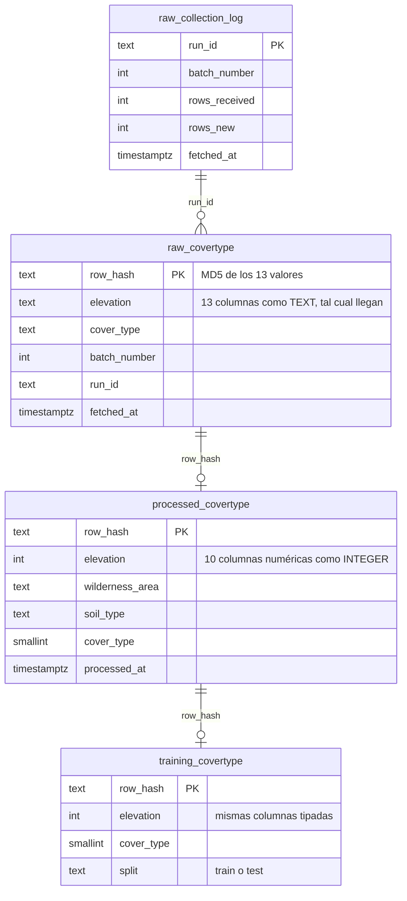

| Esquema | Etapa del enunciado | Qué la hace esa etapa |
|---|---|---|
| `raw` | Sin procesar | Los 13 valores como **TEXT**, exactamente como llegan. Solo se deduplica. |
| `processed` | Procesada | Tipos correctos y filas validadas. Las restricciones `CHECK` documentan los rangos. |
| `training` | Lista para entrenamiento | Filas procesadas + `split` estable (train/test). |

Consultar las etapas:

```bash
docker compose exec postgres-data psql -U covertype -d covertype -c \
  "SELECT (SELECT count(*) FROM raw.covertype) AS raw,
          (SELECT count(*) FROM processed.covertype) AS processed,
          (SELECT count(*) FROM training.covertype) AS training;"
```

---

## 8. Entrenamiento en Jupyter

Notebook: [`notebooks/train_covertype.ipynb`](notebooks/train_covertype.ipynb).
JupyterLab corre con **uv** y está protegido con token. Toda la configuración
llega por variables de entorno: el notebook no contiene credenciales.

### El modelo es un único `Pipeline`

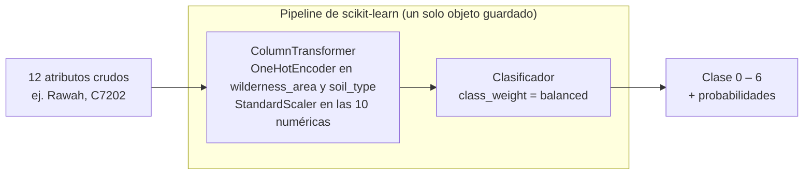

- **El encoding vive dentro del modelo.** El API recibe valores crudos y no tiene que
  replicar ninguna transformación. Entrenamiento y servicio no pueden desincronizarse.
- **`OneHotEncoder(handle_unknown="ignore")`.** Un `Soil_Type` nunca visto no rompe la
  inferencia: sus columnas quedan en cero.
- **El split viene de la tabla**, sin `train_test_split`.

### Candidatos y métrica

Se entrenan **Random Forest**, **Logistic Regression** y **HistGradientBoosting**,
todos con `class_weight="balanced"`. Se elige el modelo por **macro-F1**, que pesa
todas las clases por igual. Distribución de clases en la recolección de prueba local
(sección 13), que muestra el desbalance:

| Clase | 0 | 1 | 2 | 3 | 4 | 5 | 6 |
|---|---|---|---|---|---|---|---|
| Filas | 16.818 | 19.754 | 3.631 | **29** | 787 | 2.955 | 884 |

**Resultados sobre la recolección real** (57.968 filas, API del profesor):

| Modelo | macro-F1 | accuracy |
|---|---|---|
| **Random Forest** (promovido) | **0.860** | 0.944 |
| HistGradientBoosting | 0.789 | 0.895 |
| Logistic Regression | 0.516 | 0.661 |

La diferencia entre accuracy y macro-F1 del Random Forest (0.94 contra 0.86) es el
desbalance hecho visible. Logistic Regression rinde mal porque las clases de covertype
no son linealmente separables. En la prueba local, con 44.858 filas, el orden fue el
mismo (Random Forest 0.850, HistGradientBoosting 0.818, Logistic Regression 0.531).

### Promoción: campeón contra retador

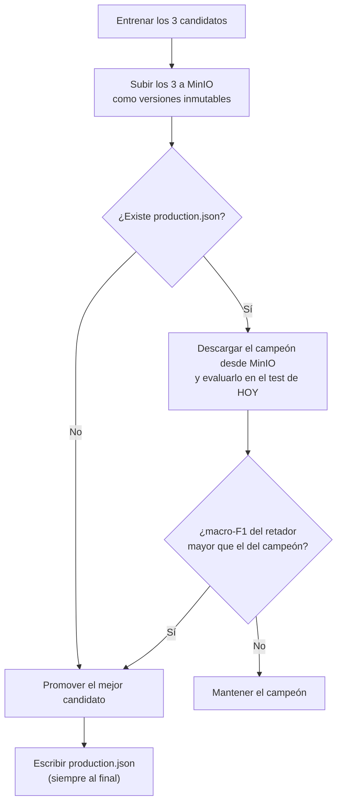

El conjunto de prueba **crece** con cada recolección. Por eso el campeón se re-evalúa
sobre el test actual, en vez de compararlo con la métrica de su `metrics.json`, que se
midió sobre otro conjunto.

---

## 9. Almacenamiento de modelos en MinIO

### Estructura del bucket `models`

```text
models/
└── covertype/
    ├── 20260927T000102Z_random_forest/
    │   ├── model.pkl          ← Pipeline completo (preprocesamiento + modelo)
    │   └── metrics.json       ← métricas, filas, clases y versiones de librerías
    ├── 20260927T000102Z_hist_gradient_boosting/ …
    ├── 20260927T000102Z_logistic_regression/ …
    └── production.json        ← puntero: qué versión sirve el API
```

- **Cada entrenamiento crea versiones nuevas** y nunca sobreescribe las anteriores.
  Esto da historial, comparación y rollback.
- **`production.json` es un puntero**, reescrito solo cuando un modelo se promueve. Se
  sube **después** del modelo, así nunca apunta a algo a medio subir. Reemplazar un
  objeto en S3 es atómico: el API ve el puntero viejo o el nuevo, nunca uno a medias.
  El rollback consiste en reescribir el puntero.
- **Las "carpetas" no existen en S3.** La consola las dibuja al separar las llaves por
  `/`.

Ejemplo de `production.json` (tomado de la prueba local; en la VM el modelo en
producción es `20260928T002222Z_random_forest`):

```json
{
  "version": "20260927T000102Z_random_forest",
  "model_key": "covertype/20260927T000102Z_random_forest/model.pkl",
  "metrics_key": "covertype/20260927T000102Z_random_forest/metrics.json",
  "model_name": "random_forest",
  "macro_f1_at_promotion": 0.8504,
  "promoted_at": "2026-09-27T00:01:02.805793+00:00",
  "library_versions": {
    "python": "3.11.16",
    "scikit-learn": "1.9.1",
    "numpy": "2.4.6",
    "pandas": "3.0.6"
  }
}
```

**Sobre la imagen de MinIO:** al intentar descargar las imágenes oficiales,
`minio/minio` respondió `pull access denied` en Docker Hub, y `quay.io/minio/minio`
(la que usa el material del curso) respondió **401**. Se usa
`cgr.dev/chainguard/minio`, que ejecuta el servidor de MinIO en su versión
`RELEASE.2026-09-22`. Está fijada por **digest** para que la VM use exactamente la
imagen probada. El bucket lo
crea `minio-init` con `mc mb --ignore-existing`.

---

## 10. API de inferencia

Documentación interactiva (Swagger): **`http://<ip-vm>:8025/docs`**

### Lógica de arranque

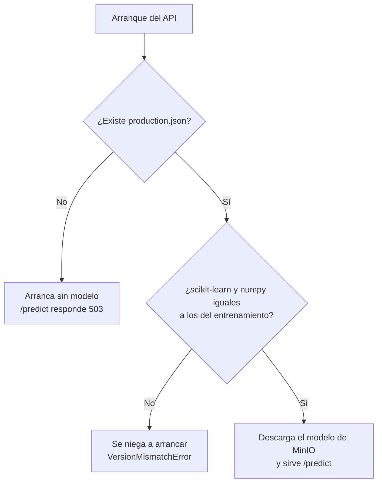

- **No tener modelo es normal** en una VM recién desplegada: el API arranca igual.
- **Un modelo incompatible es un error:** el API no arranca, para evitar predicciones
  posiblemente incorrectas sin aviso.

### Endpoints

| Método | Ruta | Respuesta |
|---|---|---|
| GET | `/health` | `{"status": "ok", "model_loaded": true}` |
| GET | `/model` | El `production.json` que se está sirviendo (versión, métricas y librerías) |
| POST | `/predict` | Clase predicha (0–6), versión del modelo y probabilidades por clase |
| POST | `/reload` | Toma un modelo recién promovido sin reiniciar el contenedor |

### Ejemplo

```bash
curl -X POST http://localhost:8025/predict -H "Content-Type: application/json" -d '{
  "elevation": 2906, "aspect": 91, "slope": 18,
  "horizontal_distance_to_hydrology": 579, "vertical_distance_to_hydrology": 95,
  "horizontal_distance_to_roadways": 1827,
  "hillshade_9am": 244, "hillshade_noon": 209, "hillshade_3pm": 88,
  "horizontal_distance_to_fire_points": 2782,
  "wilderness_area": "Commanche", "soil_type": "C7202"}'
```

```json
{
  "cover_type": 1,
  "model_version": "20260928T002222Z_random_forest",
  "probabilities": {"0": 0.0836, "1": 0.9129, "2": 0.0013, "3": 0, "4": 0.0002, "5": 0.0001, "6": 0.0019}
}
```

(Respuesta real del API desplegado en la VM, con el modelo entrenado sobre la
recolección real; ver `images/08-api.png`.)

### Códigos de respuesta

| Código | Cuándo |
|---|---|
| 200 | Predicción correcta |
| 422 | Entrada inválida: tipos o rangos fuera de los que valida el DAG (p. ej. `hillshade_9am: 300`) |
| 503 | Todavía no hay modelo en producción |
| 409 | `/reload` encontró un modelo con versiones incompatibles; se sigue sirviendo el actual |
| 404 | `/model` o `/reload` sin modelo en producción |

---

## 11. Reproducibilidad y versiones

| Componente | Versión fijada | Cómo |
|---|---|---|
| Python (Jupyter y API) | 3.11 | Imagen `python:3.11-slim` y `requires-python = "==3.11.*"` |
| scikit-learn | 1.9.1 | Igual en los dos `pyproject.toml` |
| numpy / scipy / pandas | 2.4.6 / 1.17.1 / 3.0.6 | Fijados en el API; resueltos idénticos en ambos `uv.lock` |
| joblib / threadpoolctl | 1.6.0 / 3.7.0 | Dependencias transitivas, idénticas en ambos `uv.lock` |
| Airflow | 2.9.3 | Imagen oficial |
| PostgreSQL | 15 | Imagen oficial |
| MinIO | RELEASE.2026-09-22 | Digest `sha256:bd01…5ae1` |

**Por qué importa:** scikit-learn no garantiza que un modelo serializado con una
versión cargue bien en otra. Sin fijar versiones, reconstruir una imagen podría traer
otra versión en silencio. El resultado sería un modelo que carga con una advertencia y
predice distinto. Los Dockerfiles usan `uv sync --frozen`: instalan exactamente
lo que dice el `uv.lock` y fallan si el lock está desactualizado.

**Costo asumido:** actualizar scikit-learn es una decisión explícita y obliga a
reentrenar los modelos.

---

## 12. Despliegue en la VM paso a paso

Todos los comandos son **Bash en la VM (Rocky Linux) por SSH**.

### 12.1 Requisitos

```bash
docker --version
docker compose version
```

Si no están instalados:

```bash
curl -fsSL https://get.docker.com | sh
sudo usermod -aG docker $USER
```

Cierra sesión y vuelve a entrar para usar `docker` sin `sudo`.

### 12.2 Configuración

```bash
cd MLOps/proyectos/proyecto_I
cp .env.example .env
sed -i "s/^AIRFLOW_UID=.*/AIRFLOW_UID=$(id -u)/" .env
```

Edita `.env`:

| Variable | Valor para la entrega | Por qué |
|---|---|---|
| `DATA_API_URL` | `http://10.43.97.110:8080` | El API real del profesor. Por defecto apunta a la copia local. |
| `JUPYTER_TOKEN` | Un valor propio | Jupyter queda expuesto en la red y permite ejecutar código. |
| `AIRFLOW_UID` | Resultado de `id -u` (lo pone el `sed`) | Los archivos que escriben Airflow y Jupyter quedan a tu nombre, no de root. |

> No uses `echo "AIRFLOW_UID=$(id -u)" > .env`, que sugiere la guía oficial de
> Airflow: sobrescribe todo el archivo y borra las demás variables.

### 12.3 Construir y levantar

```bash
docker compose config --quiet && echo "configuración válida"
docker compose up -d --build
docker compose ps -a
```

**Resultado esperado:** `postgres-data`, `postgres-airflow`, `minio` y `api` en
`healthy`; `airflow-scheduler`, `airflow-webserver` y `jupyter` en `Up`;
`airflow-init` y `minio-init` en **`Exited (0)`**. Sin `--profile local-data-api`, la
copia local del API no arranca.

### 12.4 Recolectar datos

Activa el DAG `covertype_pipeline` en `http://<ip-vm>:8010` (usuario y contraseña en
`.env`), o por terminal:

```bash
docker compose exec airflow-scheduler airflow dags unpause covertype_pipeline
```

> Todo DAG nuevo arranca **pausado**. Espera a que aparezca en la lista (unos segundos
> tras el arranque) antes de despausarlo.

Seguimiento:

```bash
docker compose exec postgres-data psql -U covertype -d covertype -c \
  "SELECT batch_number, rows_received, rows_new, fetched_at
   FROM raw.collection_log ORDER BY fetched_at;"
```

**Qué esperar:** una corrida por minuto. `rows_new` baja a medida que el pool se
satura, porque los duplicados no se insertan. Tras el batch 11 (~1 hora estimada:
11 ventanas de 5 min), las
corridas terminan en verde con sus tareas en *skipped*. Entonces pausa el DAG:

```bash
docker compose exec airflow-scheduler airflow dags pause covertype_pipeline
```

> Reiniciar la recolección del grupo 5 en el servidor del profesor:
> `curl "http://10.43.97.110:8080/restart_data_generation?group_number=5"`.
> Hazlo solo a propósito: borra el progreso del grupo en su servidor.

### 12.5 Entrenar

Abre `http://<ip-vm>:8012`, ingresa con tu `JUPYTER_TOKEN`, abre
`train_covertype.ipynb` y ejecuta todas las celdas (*Run → Run All Cells*). Revisa los
modelos en la consola de MinIO: `http://<ip-vm>:8011` → bucket `models`.

### 12.6 Inferencia

Si el API ya estaba corriendo cuando se promovió el modelo:

```bash
curl -X POST http://localhost:8025/reload
curl http://localhost:8025/model
```

Luego prueba `POST /predict` en `http://<ip-vm>:8025/docs`.

---

## 13. Pruebas locales sin gastar el API del profesor

Cada petición al API real consume ventanas de recolección del grupo 5. Para probar,
existe una **copia local** del API ([`data_api/`](data_api/)). Su `main.py` es el del
profesor con un solo cambio: `MIN_UPDATE_TIME` es configurable, con 30 s en vez de
300 s. El Dockerfile usa la misma versión de Python (3.9) y las mismas dependencias
fijadas, sobre la variante `slim` de la imagen.

```bash
mkdir -p data_api/data            # copiar aquí covertype.csv (32 MB, no se versiona)
# en .env: DATA_API_URL=http://data-api:80
docker compose --profile local-data-api up -d --build
```

Con el DAG, un ciclo completo de 11 batches toma unos 11 minutos: la copia rota cada
30 s, pero el DAG pide una vez por minuto, así que avanza un batch por corrida. En la
prueba registrada, el batch 3 llegó a las 17:56 y el 11 a las 18:04. Reiniciar el
contador local:

```bash
curl "http://localhost:8020/restart_data_generation?group_number=5"
```

> Con la copia local el batch rota cada 30 s, más rápido que el schedule de 1 min. Por
> eso la cobertura de la prueba local fue ~77% del pool. Con el API real, que rota
> cada 5 min, se esperan ~5 peticiones por batch y ~99% de cobertura (estimado).

---

## 14. Verificación y evidencias

### Despliegue real en la VM (API del profesor)

| Resultado | Valor |
|---|---|
| Recolección | Una corrida por minuto, de 23:14 a 00:10 UTC (27–28 sep 2026), batches 1 a 11 |
| Tope del API | Desde las 00:11 UTC las corridas terminan en `success` con sus tareas en `skipped` |
| Filas por etapa | raw = processed = training = **57.968** (ninguna fila descartada) |
| Cobertura del pool | 57.968 de 58.101 filas posibles: **99,8%** |
| Mejor modelo | Random Forest: macro-F1 **0,860**, accuracy 0,944 (promovido a producción) |
| Modelo servido por el API | `20260928T002222Z_random_forest` |

**Servicios en ejecución:** bases de datos, MinIO y API en `healthy`; `airflow-init`
y `minio-init` en `Exited (0)`.

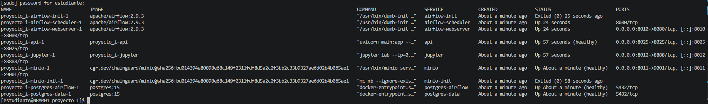

**Ejecuciones del DAG:** una corrida por minuto, todas exitosas. La última columna es
la primera corrida después del tope.

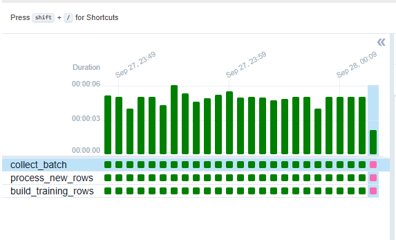

**Manejo del tope:** en la corrida de las 00:11 UTC el API ya no entrega datos;
`collect_batch` queda en *skipped* y las dos tareas siguientes también.

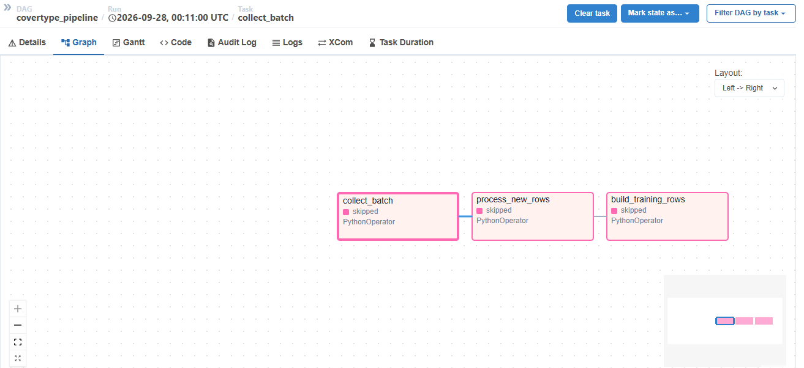

**Estructura del DAG:** tres tareas en secuencia.

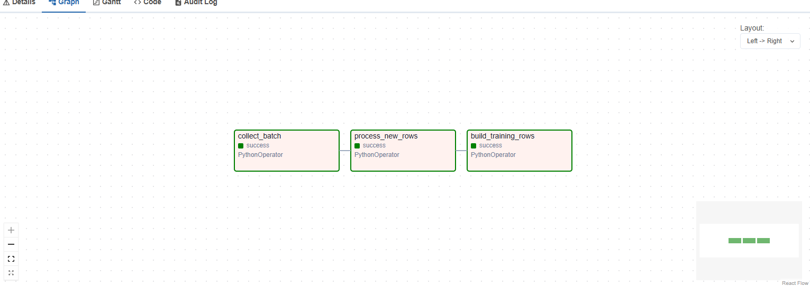

**Bitácora de recolección** (`raw.collection_log`, batches 1 a 9 visibles): 5–6
corridas por batch, y `rows_new` baja de 5.810 a unas decenas a medida que el pool se
satura.

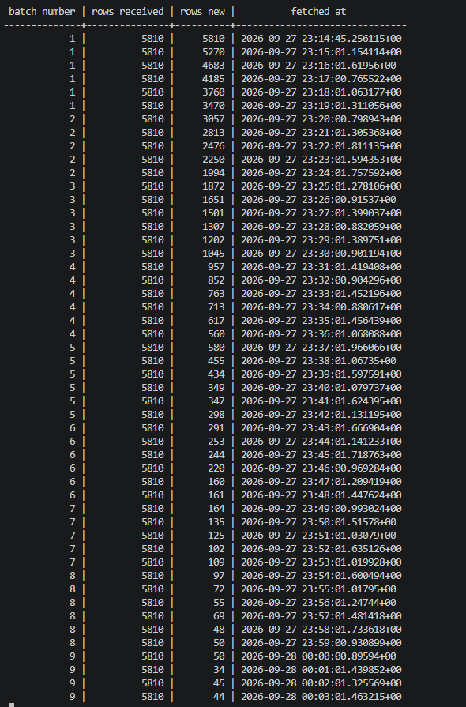

**Filas por etapa:** las tres etapas tienen las mismas 57.968 filas.

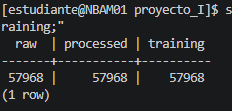

**Entrenamiento en Jupyter:** métricas de los tres candidatos sobre el test.

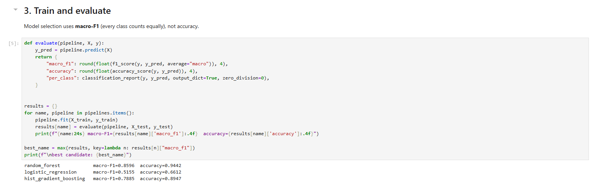

**Modelos en MinIO:** las tres versiones del entrenamiento y el puntero
`production.json`.

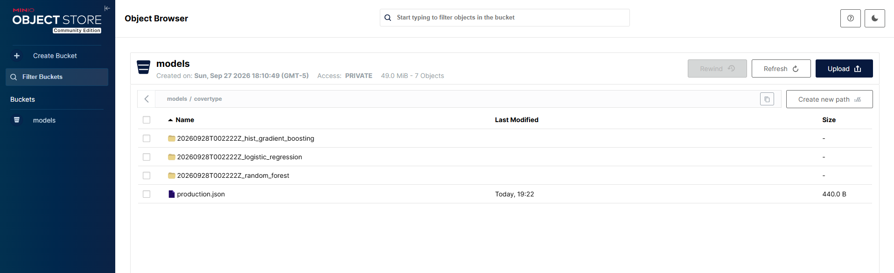

**Inferencia:** `POST /predict` desde Swagger, respuesta 200 con la clase, la versión
del modelo y las probabilidades.

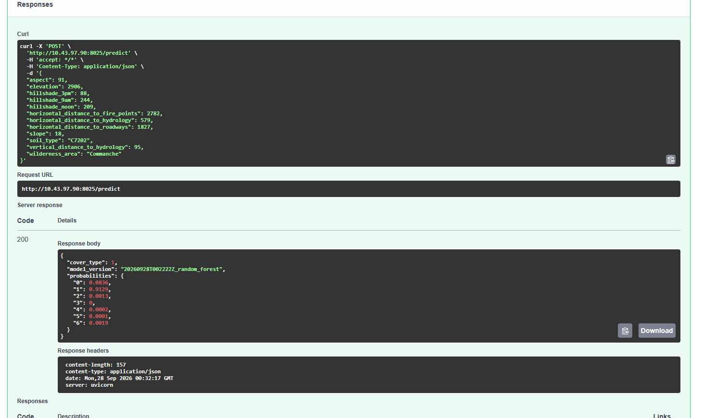

### Verificado durante el desarrollo (copia local del API)


**Recolección completa (copia local), 14 corridas hasta el tope:**

```text
 batch_number | rows_received | rows_new
--------------+---------------+----------
            1 |          5810 |     5810
            2 |          5810 |     5275
            ...
           10 |          5810 |     1575
           11 |          5810 |     1521
```

| Verificación | Resultado |
|---|---|
| Filas por etapa | raw = suma de `rows_new` = processed = training = **44.858** |
| Split | 20,1% test / 79,9% train |
| Corridas después del tope | `success` con las 3 tareas en `skipped` |
| `catchup=False` y `max_active_runs=1` | Solo el intervalo más reciente; corridas estrictamente en serie |
| Deduplicación a nivel SQL | Insertar la misma fila dos veces: `INSERT 0 1` y luego `INSERT 0 0` |

**Entrenamiento y promoción:**

- Primera corrida: sin campeón, se promueve el Random Forest.
- Segunda corrida con los mismos datos: el campeón, **descargado de MinIO**, obtiene el
  mismo 0,8504 y se mantiene. Esto prueba que el modelo deserializado predice idéntico.

**API de inferencia:**

| Prueba | Resultado |
|---|---|
| Una fila de test por clase (nunca vista en entrenamiento) | 6 de 7 aciertos; falla la clase 3 (29 filas), predicha como 5 |
| `hillshade_9am = 300` | 422 |
| `soil_type` desconocido (`C9999`) | 200, predice igual |
| Arranque con scikit-learn distinto (simulado) | Arranque rechazado |
| Arranque sin `production.json` | Arranca sin modelo |

---

## 15. Problemas encontrados y prevenidos

### Encontrados durante el desarrollo

| Síntoma | Causa | Solución |
|---|---|---|
| `minio/minio`: `pull access denied` | La imagen oficial no se pudo descargar de Docker Hub | Imagen de Chainguard fijada por digest |
| `quay.io/minio/minio`: `401 Unauthorized` | Tampoco se pudo descargar; es la que usa el material del curso | Igual que el anterior |
| `airflow dags unpause` responde "No paused DAGs were found" y el DAG no corre | El comando se ejecutó justo después de detectarse el DAG, antes de que Airflow registrara su estado | Esperar a que el DAG aparezca en la lista y repetir |
| `InconsistentVersionWarning` al cargar un modelo (taller anterior) | Versión de scikit-learn distinta a la del entrenamiento | Versiones fijadas + chequeo al arrancar |

### Prevenidos en el diseño (identificados antes de que ocurrieran)

| Riesgo | Causa | Prevención |
|---|---|---|
| El batch no rota aunque pasen 5 min | La rotación exige estrictamente > 300 s y el scheduler arranca con retraso variable | Schedule de 1 min |
| `rows_new` contaría ~10 en vez de ~5.200, sin error | `execute_values` pagina de a 100 filas y `cursor.rowcount` solo cuenta la última página | `RETURNING` con `fetch=True` |
| Un valor no numérico rompería toda la sentencia | Postgres no garantiza el orden de evaluación en `WHERE` | `CASE WHEN valor ~ regex THEN valor::INTEGER END` |
| Una restricción de rango rechazaría toda la clase 0 | `Cover_Type` va de 0 a 6, no de 1 a 7 como dice el enunciado | Rangos verificados contra el CSV completo antes de fijarlos |
| Archivos de `logs/` o `notebooks/` con dueño root en la VM | `AIRFLOW_UID` distinto de `id -u` | El `sed` de la sección 12.2 |

---

## 16. Qué cambios requieren reconstruir

| Cambio | Acción |
|---|---|
| DAG (`dags/`) | Nada: está montado y Airflow lo relee solo |
| Notebook (`notebooks/`) | Nada: está montado |
| `api/main.py` | `docker compose up -d --build api` |
| Dependencias (`pyproject.toml`) | Regenerar `uv.lock` y reconstruir la imagen |
| Variables de `.env` o puertos | `docker compose up -d` (no basta `restart`) |
| Esquema SQL (`01_schema.sql`) | Solo se aplica con el volumen vacío (ver abajo) |
| Nuevo modelo promovido | `POST /reload` en el API |

**Apagar y limpiar:**

```bash
docker compose down        # apaga; datos, modelos e historial se conservan
docker compose down -v     # ⚠️ BORRA volúmenes: datos, modelos e historial de Airflow
```

**Re-recolectar datos conservando el historial de Airflow** (para esto sirven dos
PostgreSQL separados):

```bash
docker compose rm -sf postgres-data
docker volume rm proyecto_i_postgres_data
docker compose up -d postgres-data
```

---

## 17. Alcance y limitaciones

Lo implementado y verificado está en la sección 14. Queda fuera del alcance:

- **El entrenamiento es manual**, en Jupyter, como indica el diagrama del enunciado. No
  hay un DAG que reentrene automáticamente.
- **Sin búsqueda de hiperparámetros.** Se usan parámetros fijos razonables; el proyecto
  se evalúa por el pipeline, no por exprimir la métrica.
- **La clase 3 tiene muy pocos ejemplos.** Por eso sus predicciones son las menos
  confiables, incluso con `class_weight="balanced"`.
- **Solo hay datos de una porción del dataset.** Por el comportamiento del API
  (sección 5), el modelo se entrena con ~1/10 de covertype.
- **Recargar un modelo es explícito** (`POST /reload`), no automático.
- **Credenciales de práctica.** `.env` no se versiona, pero sus valores por defecto son
  de ejemplo y deben cambiarse en un entorno real.
- **Los modelos se serializan con `pickle`.** Solo deben cargarse modelos de fuentes
  confiables.

---

## 18. Estructura del repositorio

```text
proyecto_I/
├── README.md                   # este documento
├── docker-compose.yml          # los 10 servicios
├── .env.example                # plantilla de configuración (.env no se versiona)
├── dags/
│   └── covertype_pipeline.py   # collect_batch → process_new_rows → build_training_rows
├── postgres/init/
│   └── 01_schema.sql           # esquemas raw / processed / training
├── notebooks/
│   └── train_covertype.ipynb   # entrenamiento, subida a MinIO y promoción
├── jupyter/                    # Dockerfile + pyproject.toml + uv.lock
├── api/                        # API de inferencia: Dockerfile + main.py + pyproject.toml + uv.lock
├── data_api/                   # copia local del API del profesor (solo pruebas)
├── scripts/
│   └── check_overlap.py        # verifica si los batches entregan datos distintos
├── images/                     # capturas de evidencia del despliegue
└── logs/                       # logs de Airflow (no se versionan)
```

### Referencias

- [Airflow 2.9: conceptos de DAGs y programación](https://airflow.apache.org/docs/apache-airflow/2.9.3/core-concepts/dags.html)
- [Docker Compose: `depends_on` y condiciones](https://docs.docker.com/reference/compose-file/services/#depends_on)
- [PostgreSQL: `INSERT ... ON CONFLICT`](https://www.postgresql.org/docs/15/sql-insert.html)
- [scikit-learn: persistencia y compatibilidad de modelos](https://scikit-learn.org/stable/model_persistence.html)
- [MinIO: cliente `mc`](https://min.io/docs/minio/linux/reference/minio-mc.html)
- [boto3: cliente S3](https://boto3.amazonaws.com/v1/documentation/api/latest/reference/services/s3.html)
